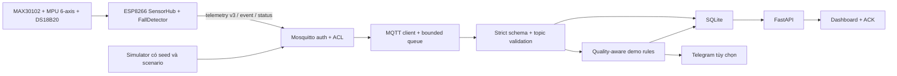

# Nghiên cứu cải tiến zero-cost cho đồ án NT532 IoT Health Edge

## Kết luận điều hành

Không nên mua thêm cảm biến, đổi vi điều khiển, chuyển sang cloud lớn hoặc làm
lại kiến trúc. Nền hiện tại đã đủ tốt để trở thành một đồ án mạnh: ESP8266,
sensor thật, MQTT, Mosquitto, FastAPI, SQLite, dashboard, simulator, schema
versioned, ACL và 164 test tự động.

Hướng cải tiến có giá trị nhất là đổi câu chuyện từ **“theo dõi bệnh nhân qua
5G”** sang:

> **Đánh giá khả năng chịu lỗi và chất lượng cảnh báo của hệ thống node cảm
> biến IoT phi lâm sàng xử lý tại edge**
>
> *Reproducible Evaluation of Quality-Aware and Fault-Tolerant Edge Alerting
> for a Non-Clinical Sensor-Node IoT Testbed*

Trục đóng góp mục tiêu là **quality-aware processing + fault injection + thí
nghiệm tái lập + UI giải thích được**, dùng toàn bộ phần cứng và laptop hiện có.
Chỉ nâng các mục tiêu này thành đóng góp sau khi có implementation và evidence.
Node thật dùng để chứng minh pipeline end-to-end; simulator nhiều node dùng để
tạo ground truth, lỗi có kiểm soát và tải lặp lại.

Ba việc phải làm trước:

1. Sửa tính nhất quán giữa lưu telemetry và áp dụng rule; hiện có cửa sổ lỗi có
   thể làm mất cảnh báo vĩnh viễn.
2. Chống status/telemetry của boot cũ ghi đè session thiết bị mới.
3. Sửa race khi đổi thiết bị trên dashboard và tách “chờ đặt ngón tay” khỏi
   “cảm biến lỗi”.

Sau đó mới xây experiment runner, KPI/export và experiment cockpit. Định vị này
tạm phù hợp với **Công nghệ IoT hiện đại NT532** mà chi phí thiết bị bằng 0;
khi có rubric chính thức phải thêm traceability matrix từ từng tiêu chí môn học
đến source, test, KPI và evidence.

## Mục lục

1. [Phạm vi và phương pháp](#1-phạm-vi-và-phương-pháp)
2. [Baseline hiện tại](#2-baseline-hiện-tại)
3. [Khoảng trống chính](#3-khoảng-trống-chính)
4. [Định vị lại mục đích sử dụng](#4-định-vị-lại-mục-đích-sử-dụng)
5. [Backlog cải tiến ưu tiên](#5-backlog-cải-tiến-ưu-tiên)
6. [Blueprint UI/UX](#6-blueprint-uiux)
7. [Thiết kế thí nghiệm](#7-thiết-kế-thí-nghiệm)
8. [Lộ trình triển khai](#8-lộ-trình-triển-khai)
9. [Kịch bản demo nghiệm thu](#9-kịch-bản-demo-nghiệm-thu)
10. [Những việc không nên làm](#10-những-việc-không-nên-làm)
11. [Nguồn tham khảo](#11-nguồn-tham-khảo)
12. [Câu hỏi chưa chốt](#12-câu-hỏi-chưa-chốt)

## 1. Phạm vi và phương pháp

### 1.1. Ràng buộc

- Không mua hoặc gắn thêm thiết bị.
- Không nâng tuyên bố thành thiết bị y tế, chẩn đoán hoặc cấp cứu.
- Không gọi traffic cùng hotspot/laptop là backhaul 5G.
- Ưu tiên KISS/YAGNI: tận dụng FastAPI, SQLite, MQTT, simulator và dashboard
  hiện có.
- Không chạy launcher hoặc upload firmware trong nghiên cứu này.

### 1.2. Cách đánh giá

- Rà toàn bộ source được Git theo dõi, tài liệu, plan, journal và hồ sơ nghiên
  cứu gốc.
- Audit độc lập ba nhánh: code/firmware, UI/UX, mục tiêu sản phẩm/học thuật.
- Kiểm tra source kết hợp probe temporary-DB cho hai failure mode quan trọng.
- Đối chiếu nguồn chính thống về bảo mật IoT, observability, accessibility và
  interoperability.
- Xếp ưu tiên theo bốn tiêu chí: giá trị NT532, độ tin cậy, chất lượng demo và
  công sức triển khai.

### 1.3. Những gì đã xác minh tại commit baseline

| Gate | Kết quả |
|---|---|
| Pytest | `164 passed in 7.24s` |
| Coverage Python | Khoảng `86,5%` raw; CLI làm tròn thành `87%` trong lượt đo này; `edge/mqtt_client.py` ở `57%` |
| Dependency check | Không có dependency Python bị hỏng |
| JavaScript syntax | `node --check edge/static/app.js` đạt |
| Docker Compose | `config --quiet` đạt |
| PlatformIO build-only | Thành công; RAM 35.224/81.920 byte (`43,0%`), flash 308.271/1.044.464 byte (`29,5%`) |

Không xác minh trong lượt này: upload firmware, cảm biến live, browser live,
Telegram trên điện thoại, tuyến 5G thật hoặc Docker named-volume runtime.

## 2. Baseline hiện tại

### 2.1. Kiến trúc



Bằng chứng kiến trúc nằm tại
[`docs/architecture-and-scope.md`](../../docs/architecture-and-scope.md),
[`edge/service.py`](../../edge/service.py),
[`firmware/health-node/src/MqttTransport.cpp`](../../firmware/health-node/src/MqttTransport.cpp)
và [`edge/static/app.js`](../../edge/static/app.js).

### 2.2. Những phần đang tốt, nên giữ

- Contract v3 strict, schema versioned, `null` đi với cờ invalid, chống field
  lạ và giữ tương thích v1/v2: `edge/schemas.py:43-322`.
- Dữ liệu chất lượng kém fail-closed; motion artifact không được biến thành số
  sinh hiệu hợp lệ: `edge/rules.py:88-186`.
- Simulator đã có normal, motion artifact, DS18B20 fault, low SpO2, high HR,
  fall và offline. Seed kiểm soát numeric jitter, nhưng `uuid4()` và live time
  chưa deterministic: `simulator/mqtt_simulator.py:18-26,57-249`.
- Queue, payload và retention đều có giới hạn; SQLite phù hợp quy mô đồ án:
  `edge/service.py:36-64`, `edge/db.py:307-421`.
- Broker tách account/ACL; Docker edge read-only, drop capabilities và chỉ bind
  dashboard vào loopback: `deploy/mosquitto/acl.template:1-12`,
  `deploy/docker-compose.yml:53-63`.
- Sensor scheduling chủ yếu non-blocking, reconnect có backoff/jitter và sensor
  fault không làm phát số cũ. MQTT `connect()` vẫn synchronous nhưng có timeout
  giới hạn: `firmware/health-node/include/AppConfig.h:27-51`,
  `firmware/health-node/src/MqttTransport.cpp:71-153`.
- Telegram bị tắt mặc định, có queue/retry và không chặn ingestion.
- UI đã có tiếng Việt, skip link, focus-visible, responsive, stale-state,
  CSP và ranh giới phi lâm sàng rõ.

Không có lý do kỹ thuật để đổi sang microservice, Kafka, database cloud hoặc
framework frontend lớn ở giai đoạn này.

## 3. Khoảng trống chính

### 3.1. Mục tiêu học thuật và sản phẩm chưa khớp

DOCX nguồn vẫn kể câu chuyện bệnh nhân, nhân viên y tế, cloud, vị trí, cấp cứu
và 5G Core; bản trích xuất nằm tại
[`research/work/input-analysis/page-text.json`](../../../research/work/input-analysis/page-text.json).
Trong khi đó source hiện tại chứng minh một prototype LAN-local phi lâm sàng.

Báo cáo nghiên cứu cũ đã chỉ ra đúng vấn đề: chưa có câu hỏi nghiên cứu,
baseline, fault model, KPI và tiêu chí nghiệm thu đủ chặt; xem
[`260727-2126-danh-gia-dinh-huong-iot-nang-cao.md`](../../../research/outputs/260727-2126-danh-gia-dinh-huong-iot-nang-cao.md)
dòng 24-33 và 69-119.

Repo chưa có framing riêng cho NT532, research question, experiment manifest
hoặc báo cáo thống kê. Checklist hiện có **21 mục hoàn tất và 48 mục mở**;
48 mục mở là khoảng trống bằng chứng, không đồng nghĩa 48 lỗi code.

### 3.2. Hai lỗi độ tin cậy cần ưu tiên cao

#### P0 — Telemetry commit trước, rule chạy sau

`edge/service.py:100-115` gọi `insert_telemetry()` rồi mới `rules.evaluate()`.
`edge/db.py:340-421` commit telemetry độc lập. Nếu process/rule lỗi sau commit,
retry cùng `(device_id, boot_id, seq)` bị trả duplicate và rule không được chạy
lại.

Probe temporary-DB đã tái hiện:

```text
FAIL_AFTER_COMMIT=True
TELEMETRY_ROWS=1
RETRY_DUPLICATE=True
ALERTS=0
```

Hậu quả: một telemetry vi phạm có thể được lưu nhưng alert tương ứng mất vĩnh
viễn. Đây là lỗi consistency, không phải thiếu tính năng.

#### P0/P1 — Boot cũ có thể ghi đè session mới

`edge/db.py:423-461` cập nhật `devices` vô điều kiện theo status đến sau, không
kiểm tra `boot_id`, sequence hoặc session đã bị supersede. Probe đã xác nhận
LWT/status của `boot-old` đến sau telemetry `boot-new` có thể làm thiết bị hiện
tại quay lại offline và mang boot cũ.

Cần coi `(device_id, boot_id)` là session, có current-session policy và quy tắc
out-of-order rõ ràng.

### 3.3. Observability chưa đủ cho đồ án nghiên cứu

- `/healthz` trộn liveness, readiness và lỗi lịch sử; một processing error làm
  trạng thái degraded cho tới restart.
- `ValidationError` đang được đưa nguyên văn vào `last_error`, sau đó trả qua
  `/healthz`; input lỗi không nên xuất hiện trong endpoint công khai.
- Chưa có queue wait, DB write latency, alert decision latency, duplicate rate
  theo thời gian hoặc recovery time. Sensor-to-edge one-way latency chỉ đo trực
  tiếp được với simulator/instrumentation có miền đồng hồ chung; node thật chỉ
  có `uptime_ms`, nên phải có phương pháp ước lượng offset/sai số trước khi dùng.
- `seq` hiện chưa có cùng semantics giữa firmware, simulator và từng loại topic;
  chưa thể coi mọi bước nhảy sequence là mất telemetry.
- API chấp nhận window tới 1.440 phút nhưng overview luôn giới hạn 1.000 mẫu.
  Với telemetry 1 Hz, raw history chỉ đủ khoảng 16,7 phút trước khi bị cắt. API
  cần downsampling/cursor và metadata `truncated`, `coverage_start/end` trước
  khi UI cho chọn window dài.

### 3.4. UI/UX có nền tốt nhưng chưa thành experiment cockpit

- Khi đổi thiết bị lúc request cũ đang chạy, `refreshInFlight` bỏ request mới
  nhưng response cũ vẫn có thể render: `edge/static/app.js:340-350,397-400`.
- “Chưa đặt ngón tay” bị gộp thành “Cần kiểm tra cảm biến”:
  `edge/static/app.js:180-195`.
- Status đang có hai dấu chấm vì HTML đã có icon, JavaScript lại thêm `●/○`.
- Biểu đồ đặt điểm theo index, không theo `received_at`; mất mẫu không tạo gap:
  `edge/static/app.js:214-250`.
- Poll 2 giây thay DOM/live-region lặp lại, có nguy cơ gây nhiễu screen reader
  và tốn tài nguyên khi tab ẩn; chưa kiểm chứng bằng browser/screen reader live.
- ACK dùng `window.prompt`, note hard-code, chưa có busy state hoặc xử lý riêng
  conflict 409: `edge/static/app.js:294-310`.
- Ảnh dashboard lưu ngày 12/08 còn bốn card DHT11, trong khi source hiện tại là
  ba card v3 wearable; evidence ảnh đã stale.

## 4. Định vị lại mục đích sử dụng

### 4.1. Mục đích mới

Đây là **phòng lab/testbed IoT edge** để trả lời câu hỏi về chất lượng dữ liệu,
độ tin cậy truyền tin, xử lý cảnh báo, khả năng phục hồi và UX vận hành. Không
phải sản phẩm theo dõi bệnh nhân.

Ba vai trò sử dụng hợp lý:

1. **Sinh viên/người nghiên cứu:** chạy scenario, fault profile, lặp thí nghiệm
   và xuất evidence.
2. **Người vận hành demo:** xem freshness, chất lượng, cảnh báo và ACK.
3. **Người chấm:** tái lập bằng manifest/seed/canonical IDs, kiểm tra KPI và
   đối chiếu claim với bằng chứng.

### 4.2. Câu hỏi nghiên cứu chính

> Khi giữ nguyên threshold, hold time, hysteresis và candidate trace, việc bật
> quality gate ảnh hưởng thế nào đến false-alert rate, missed-event rate và F1
> dưới các lỗi sensor được kiểm soát?

Câu hỏi về vị trí xử lý phải là factor riêng:

> Khi giữ nguyên stream và decision policy, local-edge so với remote-emulated
> ảnh hưởng thế nào đến simulator emit-to-decision, emit-to-alert-visible,
> logical alert delivery và recovery dưới delay/jitter/loss/outage được kiểm
> soát?

Với simulator, latency end-to-end phải được phân rã thành `emit-to-ingest`,
`ingest-to-decision` và `decision-to-visible`; nếu chỉ báo
`ingest-to-decision` thì phần network trước ingestion đã bị bỏ ngoài phép đo.
“Alert delivery” phải báo riêng theo endpoint: commit logic vào DB, quan sát
được qua API/dashboard và transport ngoài tùy chọn; không gộp ba mức thành một
tỷ lệ thành công.

Câu hỏi phụ:

- Session-aware ingestion giảm sai trạng thái online/offline và alert mất do
  replay/out-of-order bao nhiêu?
- Hệ thống giữ được throughput, queue-drop rate và API latency nào khi tăng từ
  1 lên 10 rồi 50 node ảo?
- Mục tiêu thiết kế UX là giúp người dùng phân biệt “không có dữ liệu”, “dữ
  liệu invalid”, “dữ liệu cũ” và “cảm biến lỗi”. Chỉ biến mục tiêu này thành
  kết luận nghiên cứu nếu có usability test theo task, đo tỷ lệ phân loại sai và
  thời gian hoàn thành; Playwright/axe không đo được comprehension.

### 4.3. Mục tiêu đóng góp và điều kiện tuyên bố

Sau khi implementation và acceptance đạt, có thể gọi các mục đã có evidence là
**đóng góp ở cấp đồ án môn học**, chưa gọi là novelty khoa học:

- Contract versioned kết hợp quality flag và alert fail-closed.
- Fault injection có ground truth và seed tái lập.
- So sánh ablation quality-gate trên cùng experimental candidate trace.
- Theo dõi session/reboot, duplicate, gap, stale và recovery.
- Dashboard giải thích vì sao alert mở hoặc vì sao dữ liệu bị suppress.
- Evidence package tự sinh, không chứa secret/PII.

## 5. Backlog cải tiến ưu tiên

Mọi mục dưới đây đều dùng phần mềm và phần cứng sẵn có. “Chi phí 0” không có
nghĩa là không tốn thời gian phát triển.

| ID | Ưu tiên | Cải tiến | Tác động | Công sức | Tiêu chí nghiệm thu chính |
|---|---|---|---|---|---|
| ZC-01 | P0 | Transactional inbox/rule/outbox hoặc `rule_applied_at` có replay | Không mất alert khi crash giữa insert và rule | M | Fault injection rồi restart/retry: đúng 1 telemetry, đúng 1 alert và đúng 1 logical outbox item; delivery ngoài vẫn best-effort |
| ZC-02 | P1 | Chống race đổi thiết bị; state machine đo riêng | Không hiển thị nhầm node; không gọi chờ thao tác là lỗi sensor | S-M | Response cũ không render sau khi đổi node; có test race; đủ state `waiting/measuring/valid/noisy/fault/stale` |
| ZC-03 | P0 | Session table theo `(device_id, boot_id)`, sequence/gap/out-of-order policy | Chống LWT/boot cũ rewind trạng thái; làm sạch KPI | M | Old LWT/out-of-order không đổi current session; định nghĩa sequence theo stream hoặc chuẩn hóa để status/event không bị tính nhầm thành mất telemetry |
| ZC-04 | P1 | Experiment runner: manifest, deterministic IDs/time, repeats, ground truth | Biến simulator thành thí nghiệm tái lập | M | Một lệnh chạy matrix; cùng seed cho cùng canonical stream; broker test cô lập có credential/ACL riêng từng node ảo; xuất raw + summary |
| ZC-05 | P1 | Experimental envelope + ablation quality gate | Tạo đối chứng hợp lệ mà không làm yếu production schema | M | Cùng raw candidate, threshold, hold và hysteresis; chỉ quality gate thay đổi; báo precision/recall/F1 theo episode |
| ZC-06 | P1 | Metrics và evidence export có clock-domain rõ | Có p50/p95, queue, DB/API latency và recovery | M | JSON/CSV/Markdown chứa commit, config đã khử secret, seed, schema, injection point, clock domain, kết quả và giới hạn |
| ZC-07 | P1 | Experiment cockpit + time-series aggregation | Demo trực quan, giải thích được và không che dữ liệu bị cắt | M | Timeline theo timestamp có gap; metadata coverage/truncated; bảng tương đương; alert ghi device/session; min/max chỉ tính mẫu hợp lệ |
| ZC-08 | P1 | Accessibility/mobile/ACK dialog | UX vận hành đáng tin hơn | M | WCAG 2.2 AA áp dụng được; reflow 320 px; contrast/focus/screen-reader test; dialog quản lý focus/busy/409; target 44 px là mục tiêu usability |
| ZC-09 | P1 | Một lệnh `verify.ps1` + behavioral native/integration tests | Tái lập trên máy chấm; giảm test “tìm chuỗi source” | M | Pytest + coverage + JS + native test + build-only + Compose + secret scan; tuyệt đối không upload |
| ZC-10 | P2 | Event receipt và persistent ring outbox trên flash sẵn có | Event chịu broker outage/reboot tốt hơn | L | Broker down khi event xảy ra rồi hồi phục: DB nhận đúng một logical event; receipt idempotent |
| ZC-11 | P2 | Tách `doctor/start/verify/flash`; runtime config qua Serial | Không phải rebuild vì IP đổi; tránh launcher upload ngầm | M | `start/verify` không flash; chỉ `flash --port`; đổi broker IP không rebuild; secret không vào log |
| ZC-12 | P2 | Adapter về `NormalizedTelemetry` và migration versioned | Dễ thêm schema mà không lệch validator/DB mapping | M | Golden v1/v2/v3 giữ output; migration chạy lặp idempotent; thêm v4 không sửa model cũ |
| ZC-13 | P2 | WoT Thing Description và NIST capability matrix | Tăng interoperability và security traceability | S-M | TD đúng endpoint/security thật; matrix ghi `supported/partial/not-supported` kèm evidence, không tuyên bố compliance |

`S/M/L` là nhỏ/vừa/lớn tương đối trong repo này.

Telegram hoặc transport bên thứ ba không thể được cam kết exactly-once: server
có thể đã nhận nhưng client timeout rồi retry. ZC-01 chỉ cam kết idempotency nội
bộ và một logical outbox item; delivery ngoài tiếp tục là best-effort.

### 5.1. Ghi chú thiết kế cho ZC-01

Hai phương án chấp nhận được:

1. **Đơn giản nhất:** thêm trạng thái processing cho telemetry; duplicate có
   `rule_applied_at IS NULL` được replay rule; alert/outbox có idempotency key.
2. **Chặt hơn:** một transaction chứa inbox + state transition + alert/outbox,
   worker chỉ đánh dấu hoàn tất sau commit.

Không nên giữ state `pending_since` chỉ trong RAM nếu mục tiêu là chứng minh
recovery sau restart. Có thể persist tối thiểu rule state hoặc replay đủ cửa sổ
mẫu gần nhất khi khởi động.

### 5.2. Ghi chú thiết kế cho ZC-04/ZC-05

Production MQTT v3 vẫn giữ invariant invalid-value thành `null`. Experiment
runner tạo một **envelope ngoài production contract** gồm raw candidate, quality
flags và ground-truth episode. Baseline và engine quality-aware đọc cùng
candidate trace; baseline chính giữ nguyên threshold/hold/hysteresis và chỉ tắt
quality gate. Các ablation bỏ hold hoặc hysteresis phải báo thành factor riêng.

`uuid4()` và live `time.monotonic()` hiện làm metadata khác nhau dù RNG seed
giống nhau. Runner phải sinh deterministic run/boot/event ID và logical time,
hoặc canonicalize các field runtime trước khi so stream.

Capacity test dùng broker profile cô lập với credential/ACL sinh riêng cho từng
node ảo. Không mở wildcard cho account production và không dùng nhiều client
cùng `device_id` để giả thành nhiều node.

### 5.3. Ghi chú thiết kế cho ZC-10

Chỉ persist **event rời rạc**, không persist toàn bộ telemetry 1 Hz. Dùng ring
nhỏ có CRC/version, giới hạn write, xóa khi nhận receipt theo `event_id`. Cách
này tránh biến flash ESP8266 thành data logger và giảm wear.

## 6. Blueprint UI/UX

```text
[ IoT Health Edge ] [Edge: sẵn sàng] [Node: online · 8 giây trước]
[ PROTOTYPE PHI LÂM SÀNG — không dùng để chẩn đoán ]

[Thiết bị ▼] [Khung 15 phút ▼] [Kịch bản ▼] [Hồ sơ lỗi mạng ▼]
[Chạy thí nghiệm] [Làm mới dữ liệu] [Xuất bộ minh chứng]
[TRẠNG THÁI ĐO: Chờ đặt ngón tay | Đang đo | Có nhiễu | Dữ liệu cũ]

[Nhịp tim] [SpO2 tham khảo] [Nhiệt độ bề mặt cổ tay]

[CẢNH BÁO ĐANG HOẠT ĐỘNG]
[Thiết bị/session | mức độ | lý do | thời điểm | Đánh dấu đã xem]

[Xu hướng: hiện tại · min · max · mẫu hợp lệ/tổng mẫu · độ phủ]
[biểu đồ theo timestamp; ngắt đường tại khoảng mất dữ liệu]

[Vì sao dữ liệu bị loại] [Kết nối/session/firmware]
[KPI thí nghiệm]          [Lịch sử cảnh báo]
```

Thứ tự mobile 320 px: disclaimer → trạng thái Edge/node → selector → trạng thái
đo → số đo → cảnh báo/hành động → biểu đồ + bảng dữ liệu → chất lượng/session →
KPI/lịch sử. Toolbar stack một cột; cảnh báo ưu tiên trước biểu đồ.

### 6.1. Mô hình trạng thái UI

| Lớp | Trạng thái cần tách |
|---|---|
| Edge | Đang kết nối, sẵn sàng, degraded, không phản hồi |
| Thiết bị | Online, stale, offline, boot mới, boot cũ bị bỏ qua |
| Phép đo | Chờ thao tác, đang tích lũy mẫu, hợp lệ, có nhiễu, sensor fault |
| Cảnh báo | Mở, đã xem, đã kết thúc; “đã xem” không có nghĩa “đã xử lý” |
| Thí nghiệm | Chưa chạy, đang chạy, hoàn tất, thất bại, evidence chưa đủ |

### 6.2. Acceptance UX

- Mục tiêu là các tiêu chí **WCAG 2.2 AA áp dụng được**, không chỉ “axe xanh”.
  Text thường đạt contrast `4,5:1`, text lớn và non-text/focus indicator đạt
  `3:1`; kiểm cả forced-colors, zoom 400%, resize text 200% và reflow 320 CSS px.
- Không dùng màu làm dấu hiệu duy nhất; alert có text mức độ và legend rõ.
- `Intl.NumberFormat("vi-VN")` và mapping toàn bộ `fall_state` sang tiếng Việt.
- Pause polling khi tab ẩn; backoff khi lỗi. Live-region chỉ announce chuyển
  trạng thái Edge/node, alert mới và kết quả ACK; telemetry thường im lặng hoặc
  throttle, không announce mỗi lần poll.
- URL lưu device, metric, window, scenario, profile và `run_id`; mở URL không
  được tự chạy thí nghiệm hoặc gây side effect.
- Biểu đồ có bảng/summary tương đương cho screen reader, legend không phụ thuộc
  màu và keyboard/touch access. Định nghĩa timezone, gap threshold,
  `valid/total`, coverage, downsampling và `truncated` rõ; min/max chỉ tính mẫu
  hợp lệ.
- Mỗi cảnh báo ghi device/session/freshness; có filter/sort và pagination trước
  khi demo 10-50 node để tránh ACK nhầm.
- ACK dialog có accessible name/description, focus ban đầu, focus trap, Escape,
  trả focus về nút gọi, busy state, chống bấm đôi, lỗi inline/live và copy riêng
  cho HTTP 409.
- Target 44x44 px là mục tiêu usability; minimum WCAG 2.2 AA 2.5.8 là 24x24 px
  với ngoại lệ spacing. Không được dùng 44 px như một tuyên bố conformance.
- Playwright + axe kiểm tra 320/360/768/1440 px, keyboard, offline, long text,
  multi-device và race. Gate: 0 vi phạm WCAG 2.2 A/AA áp dụng được nhưng chưa
  xử lý; mọi finding axe ở bất kỳ severity nào phải được sửa hoặc có biên bản
  false-positive/not-applicable kèm bằng chứng. Bắt buộc thêm manual
  screen-reader/focus-order test vì automation không chứng minh toàn bộ WCAG
  hoặc hành vi live-region.
- Nếu muốn claim UX comprehension, làm task test nhỏ không dùng dữ liệu sức
  khỏe thật; đo tỷ lệ phân loại đúng bốn trạng thái và thời gian hoàn thành.
- Chụp lại evidence UI từ schema/commit hiện tại; bỏ ảnh DHT11 cũ khỏi bộ minh
  chứng chính.

WCAG 2.2 là mục tiêu phù hợp vì tiêu chí có thể kiểm thử và áp dụng cho desktop,
mobile; chỉ tuyên bố mức conformance sau audit đầy đủ cả tự động và thủ công.

## 7. Thiết kế thí nghiệm

### 7.1. Hai engine để đối chứng

- **Ablation không quality gate:** dùng raw candidate, cùng threshold, hold và
  hysteresis nhưng bỏ quality/finger/motion gating.
- **Engine quality-aware:** dùng cùng raw candidate và cùng rule timing, nhưng
  áp quality flag, finger presence, PPG và motion validity trước khi quyết định.

Cả hai đọc cùng một experimental envelope có raw candidate, quality và ground
truth. Raw candidate invalid **không được publish** vào production MQTT; mapper
production vẫn phát `null` đúng strict v3. Nếu muốn thử “threshold thuần không
hold/hysteresis”, đó là ablation thứ hai và không được gộp kết quả với hiệu ứng
của quality gate.

### 7.2. Scenario và fault profile

| Nhóm | Profile |
|---|---|
| Sensor/data | normal, no-finger, motion artifact, DS18B20 fault, invalid frame, stuck value |
| Event | low SpO2 demo, high HR demo, fall event, duplicate event |
| Transport | delay, jitter, loss, duplicate, reorder, outage, reconnect |
| Session | reboot, sequence wrap/gap, old LWT after new boot |
| Capacity | 1, 10, 50 node ảo; tốc độ publish cố định |

Network impairment là **mô phỏng có kiểm soát**, không gọi là 5G thật. Nếu
muốn so “local edge” và “remote-emulated”, giữ cùng stream/seed và chỉ thay
profile delay/jitter/loss/outage. Manifest phải ghi injection point: app-side
chỉ là message impairment; muốn đo transport phải inject tại proxy/network path.

Capacity profile chạy trên broker test cô lập với credential/ACL và client ID
riêng từng node. Production ACL không thay đổi. Reproducibility yêu cầu ID và
logical timestamp deterministic, hoặc canonicalization được mô tả rõ.

Sequence/gap phải định nghĩa theo từng stream. Firmware hiện chia một counter
cho telemetry/event/status, simulator lại có semantics khác; status/event không
được mặc nhiên tính thành telemetry loss.

### 7.3. KPI

| Nhóm | KPI |
|---|---|
| Alert quality | Precision, recall, F1, false alert/1.000 telemetry, missed-episode rate |
| Latency | Simulator emit-to-decision và emit-to-alert-visible, phân rã thành emit-to-ingest, ingest-to-decision và decision-to-visible; báo p50/p95, chỉ báo p99 khi đủ mẫu và ghi rõ miền đồng hồ |
| Reliability | Tỷ lệ logical commit DB, API/dashboard-visible và external-delivery báo riêng; duplicate-alert rate, stale-detection time, recovery time |
| Data quality | Valid ratio, per-stream gap rate, out-of-order rate, số alert bị suppress theo lý do |
| Capacity | Message/s, queue depth/drop, DB write p95, API p95, CPU/RAM |
| Reproducibility | Seed, commit, schema, config hash, số lần lặp, raw evidence đầy đủ |

Ground truth dùng `episode_id`, loại event, `start/end` và matching window định
trước. Mỗi episode chỉ tạo tối đa một true positive; alert thêm trong cùng
episode là duplicate. HR/SpO2 và fall được chấm riêng. Invalid frame bị reject ở
ingestion là KPI validation, không tự động tính thành missed alert.

Khuyến nghị tối thiểu 30 lượt/profile với seed ghi lại, báo p50/p95 và khoảng
tin cậy theo **run**. Không báo đồng thời “median” và p50 như hai chỉ số khác
nhau. Chỉ báo p99 khi có tối thiểu khoảng 1.000 quan sát phù hợp, ghi rõ đó là
message-level hay run-level; 30 lượt không đủ để ước lượng p99 ổn định.

Node thật không có timestamp đồng bộ với edge, nên không tuyên bố one-way
sensor-to-ingest latency nếu chưa có clock-offset/error method. Với node thật,
ưu tiên ingest-to-decision; với simulator cùng host có thể instrument emit và
browser-render timestamp để đo end-to-end trong miền đồng hồ đã mô tả.

### 7.4. Evidence package

```text
evidence/<run-id>/
├── manifest.json          # scenario, seed, profile, commit, schema
├── config-redacted.json   # không có credential
├── candidate-trace.jsonl  # raw candidate, không phải production MQTT
├── ground-truth.jsonl     # episode + matching window
├── observed-events.jsonl
├── metrics.csv
├── summary.json
├── report.md
└── screenshots/           # chỉ khi cần cho demo
```

## 8. Lộ trình triển khai

Ước lượng cho một người đã quen repo; không bao gồm thời gian chờ phần cứng.

### Giai đoạn 0 — Correctness trước demo, 2-3 ngày

- ZC-01 transactional/replay-safe ingestion.
- ZC-03 session/sequence freshness.
- ZC-02 dashboard race + measurement state.
- Regression tests cho hai probe DB đã tái hiện và race UI.

Gate: full suite qua; fault injection không mất logical alert; old LWT không
rewind session; đổi node liên tục không render nhầm dữ liệu.

### Giai đoạn 1 — Biến demo thành thí nghiệm, 4-6 ngày

- ZC-04 experiment manifest/runner.
- ZC-05 experimental envelope + quality-gate ablation.
- ZC-06 metrics/export.

Gate: một lệnh chạy matrix nhỏ và tạo evidence package; cùng seed cho canonical
ground truth giống nhau; deterministic/canonical IDs được kiểm tra; multi-node
dùng broker/ACL test cô lập.

### Giai đoạn 2 — UI/UX và bàn giao, 3-4 ngày

- ZC-07 experiment cockpit.
- ZC-08 accessibility/mobile/ACK.
- ZC-09 one-command verification và fresh screenshots.

Gate: demo flow hoàn chỉnh trên desktop/mobile; build-only không upload; người
chấm tái lập được từ clean clone.

### Giai đoạn 3 — Mở rộng nếu còn thời gian, 3-5 ngày

- ZC-10 receipt/persistent event outbox.
- ZC-11 safe runtime configuration và tách launcher.
- ZC-12 normalized model/migration.
- ZC-13 Thing Description và NIST capability matrix không claim compliance.

Không để giai đoạn 3 làm trễ giai đoạn 0-2.

## 9. Kịch bản demo nghiệm thu

1. Chạy `normal`: node online, không alert, KPI baseline được ghi.
2. Chạy experimental `motion_artifact`: envelope giữ raw candidate để hai
   ablation dùng chung; production MQTT vẫn phát HR/SpO2 `null`. UI giải thích
   lý do; quality-aware suppress, nhánh tắt quality gate có thể tạo false alert.
3. Chạy `low_spo2`: dữ liệu quality hợp lệ, qua hold time, mở đúng một alert;
   ACK actor/note được lưu.
4. Phát duplicate fall event: chỉ một logical event/alert.
5. Phát old LWT sau boot mới: UI/session hiện tại không bị rewind.
6. Bật profile delay/loss/outage: UI hiện stale/offline; khi phục hồi ghi được
   recovery time và không tạo alert trùng.
7. Trên broker/ACL test cô lập, chạy 1/10/50 node ảo có identity riêng: báo
   throughput, queue drop, DB/API p95.
8. Export evidence package; secret scan xác nhận không có credential/PII.
9. Node vật lý hiện có phát một stream v3 để chứng minh nối end-to-end; không
   suy ra độ chính xác y tế.

## 10. Những việc không nên làm

- Không mua sensor mới chỉ để tăng số card dashboard.
- Không đổi SQLite/FastAPI thành cloud/microservice nếu chưa có bottleneck đo
  được.
- Không thêm AI/ML chỉ để có từ khóa; dataset/ground truth hiện chưa đủ cho
  claim mô hình tốt hơn rule.
- Không gọi simulator hiện tại là digital twin vật lý đã hiệu chuẩn. Có thể gọi
  là virtual node/test double; chỉ nâng claim khi mô hình state/behavior được
  xác minh.
- Không nâng MQTT 3.1.1 lên MQTT 5 chỉ vì “hiện đại”; chỉ đổi khi một feature
  cụ thể có lợi ích và firmware/library chịu được.
- Không public TCP 1883 hoặc dashboard ra Internet. Nếu sau này mở dashboard
  ra LAN, phải thêm auth/rate-limit cho API ACK trước.
- Không gọi hotspot peer-to-peer là 5G backhaul. Profile mô phỏng không phải
  benchmark nhà mạng và không đủ để giữ “5G” trong tên/kết luận.
- Không gọi DS18B20 là nhiệt độ cơ thể, MAX30102 là thiết bị y tế, hoặc fall
  event là phát hiện ngã đã hiệu chuẩn.
- Không dùng Telegram như kênh cấp cứu hoặc delivery bảo đảm.

## 11. Nguồn tham khảo

### Nguồn dự án

- [`README.md`](../../README.md)
- [`docs/architecture-and-scope.md`](../../docs/architecture-and-scope.md)
- [`docs/data-contract.md`](../../docs/data-contract.md)
- [`docs/network-and-security.md`](../../docs/network-and-security.md)
- [`docs/test-checklist.md`](../../docs/test-checklist.md)
- [`edge/service.py`](../../edge/service.py)
- [`edge/db.py`](../../edge/db.py)
- [`edge/static/app.js`](../../edge/static/app.js)
- [`simulator/mqtt_simulator.py`](../../simulator/mqtt_simulator.py)

### Nguồn chính thống bên ngoài

- [NIST IR 8259 Rev. 1 — Foundational Cybersecurity Activities for IoT Product Manufacturers](https://csrc.nist.gov/pubs/ir/8259/r1/final), bản final tháng 4/2026. Dùng để định hướng security xuyên vòng đời thay vì chỉ thêm một cờ TLS.
- [NIST IR 8259A — IoT Device Cybersecurity Capability Core Baseline](https://csrc.nist.gov/pubs/ir/8259/a/final). Dùng cho matrix identification, configuration, data protection, logical access, software update và cybersecurity state awareness.
- [W3C WCAG 2.2](https://www.w3.org/TR/WCAG22/). Dùng làm chuẩn tham chiếu accessibility có tiêu chí kiểm thử.
- [OpenTelemetry Observability Primer](https://opentelemetry.io/docs/concepts/observability-primer/). Dùng khái niệm metrics/logs/traces, SLI/SLO; không bắt buộc cài cả stack OpenTelemetry.
- [W3C Web of Things Thing Description 1.1](https://www.w3.org/TR/wot-thing-description11/). Dùng cho artifact interoperability tùy chọn, mô tả metadata, properties, actions/events và security của Thing.

## 12. Câu hỏi chưa chốt

Các câu hỏi này không chặn giai đoạn 0-1:

1. Deadline, số thành viên và rubric cụ thể của NT532 là gì?
2. Giảng viên có bắt buộc giữ từ “5G” trong tên đề tài không? Generic network
   impairment emulation vẫn không chứng minh 5G và không đủ để dùng 5G trong
   tên/kết luận; 5G thật chỉ là future validation cho tới khi có endpoint/tuyến
   và phép đo phù hợp.
3. Dashboard có cần mở cho điện thoại khác trong LAN không? Nếu không, giữ
   loopback và hoãn auth API.
4. Mục tiêu bàn giao chính là source/demo, báo cáo học thuật hay dataset? Lộ
   trình trên giả định cần cả ba nhưng ưu tiên source + demo tái lập.

## Bước tiếp theo đề xuất

Triển khai ZC-01 và ZC-03 trước, thêm regression tái hiện hai lỗi consistency,
rồi sửa ZC-02 và chạy lại pytest/build/Compose. Chỉ sau khi correctness/session
sạch mới tạo ZC-04 experiment runner; không bắt đầu bằng redesign giao diện
hoặc thêm tính năng phần cứng.
